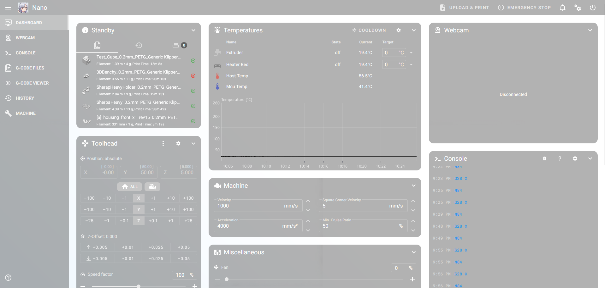

# Klipper-LightTheme
----------------------------------------------------------


*Fluidd has it's quirks, use at your own will*

Install any theme from kiauh and swap the custom.css found in .theme

OR

Delete the .theme and paste this into an ssh dialog for mainsail:
```
git clone https://github.com/Suzu0071/Klipper-LightTheme ~/printer_data/config/.theme
```
For fluidd:
```
git clone https://github.com/Suzu0071/Klipper-LightTheme ~/printer_data/config/.fluidd-theme
```
If you use this somewhere, cite it with my ugly face c:

With love, from Suzuki

UwU
